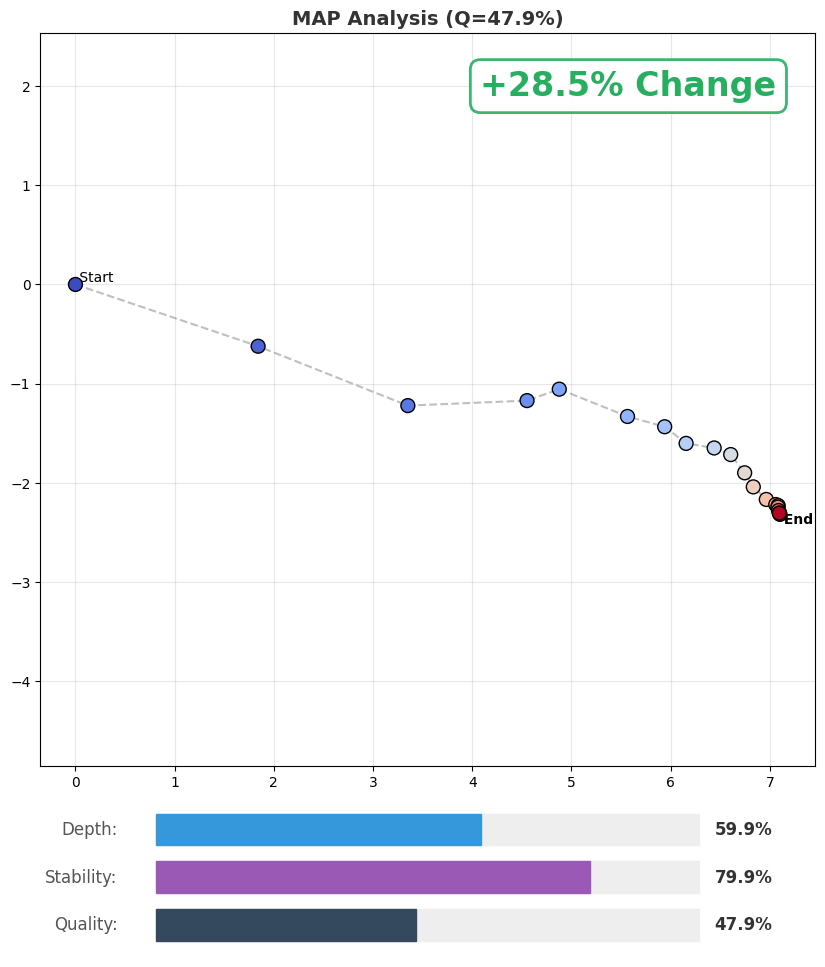
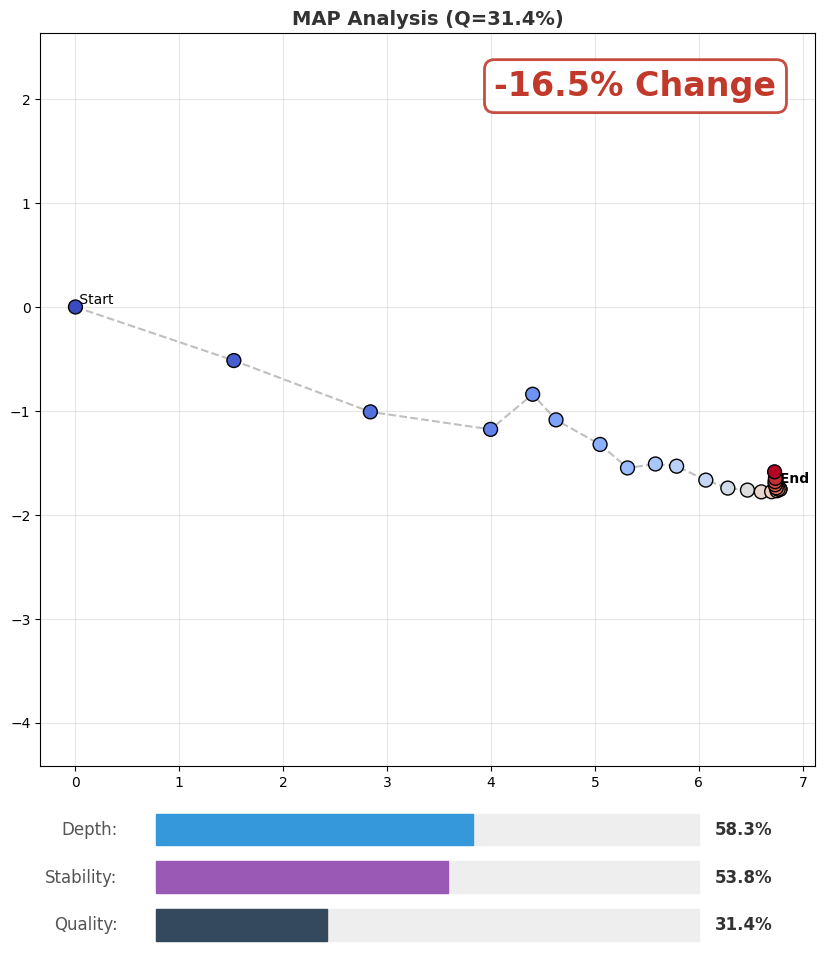
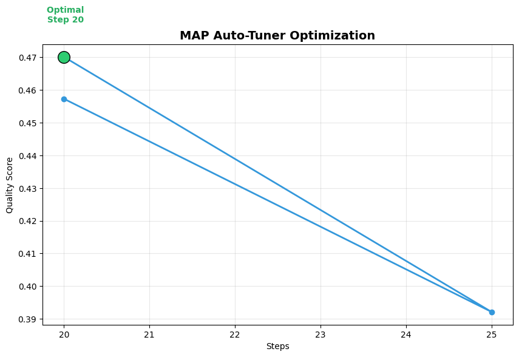

# MAP-ComfyUI (v0.2)

**A Geometric "Vector Network Analyzer" for Stable Diffusion Latent Trajectories.**

[](https://doi.org/10.5281/zenodo.18091447) [](https://doi.org/10.5281/zenodo.18091447) [](LICENSE)

This custom node implements the **Manifold Alignment Protocol (MAP)** within ComfyUI. It transforms the "black box" of diffusion sampling into a measurable, visualizable geometric process.

Instead of guessing whether `Step=40` is better than `Step=30`, or which Scheduler works best, MAP-Probe quantifies the **Semantic Confidence (Depth)** and **Structural Stability (Convergence)** of the generation process.

For the theoretical foundation behind MAP, please visit the main repository:

👉 https://github.com/JBKing514/map_blog

---

## ⚠️ Important: Installation Requirement

**This node requires `matplotlib` to generate visualization plots.**

You **MUST** install it in the Python environment used by ComfyUI.

### For Windows Portable Users:
Open a terminal in your `ComfyUI_windows_portable` folder and run:
```cmd
.\python_embeded\python.exe -m pip install matplotlib
```

### For Standard venv/Conda Users:
Activate your environment and run:
```bash
pip install matplotlib
```

---

## Features

### 🔬 Manual Analysis (The VNA Mode)
Acts like an oscilloscope for your diffusion process.
- **Differential Tracking:** Automatically detects if you are using the same seed as the previous run.
- **Visual Feedback:** Displays **Green (Improvement)** or **Red (Regression)** to show exactly how your prompt or parameter tweaks affect generation quality.
- **Quantified Metrics:**
    - **Depth:** How deep the latent vector penetrated the semantic manifold (Signal Strength).
    - **Stability:** Whether the trajectory stabilized at the attractor well (Convergence Quality).

### 🤖 Auto-Tuner (Smart Optimization)
A "Self-Driving" mode that performs a 3-Phase Optimization:
1.  **Step Search (Hill Climb):** Iterates steps (e.g., 20, 25, 30...) to find the rough peak Q-score.
2.  **Scheduler Sweep (New!):** Once the optimal step count is found, it automatically tests all available schedulers (Normal, Karras, Exponential, SGM, etc.) to find the mathematically optimal solver for your model.
3.  **CFG Refinement:** Fine-tunes CFG scale around the optimal point with a user-definable range.

### 📊 Dashboard Visualization (New!)
- **Split-View Layout:** Results are displayed in a professional, non-overlapping Dashboard below the trajectory plot.
- **Phase Markers:** Distinct visual markers for Steps (Line), Scheduler attempts (Triangles), and CFG trials (Stars).
- **Auto-CSV:** Successfully optimized runs are logged to `ComfyUI/output/MAP_Tuning_Log.csv`.

---

## Usage

### 1. Basic Setup
Search for the node **"MAP Pro Suite"**. It functions as a replacement for the standard `KSampler`.

- **Input:** Connect Model, Positive/Negative Conditioning, and Empty Latent.
- **Output:**
    - `LATENT`: The best latent found (passed to VAE Decode).
    - `IMAGE`: The trajectory analysis plot (connect to `Preview Image`).
    - `STRING`: Detailed analysis text.

### 2. Operation Modes

#### Mode A: `Analyze (Manual)`
Best for exploration and manual tweaking.
1.  Run with a **Random Seed** to establish a reference.
2.  Switch to **Fixed Seed**.
3.  Tweak parameters. The plot will show a **Δ (Delta)** indicating improvement.

#### Mode B: `Auto-Tune (Hill Climb)`
Best for finding the "Sweet Spot" of a Model/Prompt combo.

**Parameters:**
- `tuner_max_steps`: Hard limit for step search (e.g., 50).
- `tuner_stride`: Step increment (e.g., 5).
- `tuner_optimize_scheduler` (**New**): If Enabled, the node will lock the best step count and brute-force test all schedulers to find the best ODE solver.
- `tuner_cfg_range` (**New**): Defines the search radius for CFG (e.g., 0.5 means checking `Base +/- 0.5`).

**Output:**
The node returns the **Best Latent** found across all three optimization phases.

## ⚖️ Disclaimer: Stability ≠ Aesthetics  
**MAP-Probe optimizes for Geometric Stability (Q-Score)** — not beauty.

MAP focuses on improving the **mathematical convergence quality** of the sampling process:

- Clearer and more stable **line art**  
- Smoother and more consistent **shadows & gradients**  
- Reduced **over-baking / ringing artifacts**  
- Better structural consistency across seeds

This does *not* always look “more beautiful,” because:

- Some artistic styles (sketch / watercolor / noisy anime shading) naturally have **low stability**  
- Human preference is nonlinear and style-dependent  
- MAP rewards *geometric clarity*, not subjective appeal

### Why it still matters  
Images with higher MAP-Q scores tend to:

- Convert **much better in ESRGAN / SwinIR upscaling**  
- Handle **hi-res fix with lower denoise (0.10–0.20)** without collapsing  
- Produce **cleaner feature boundaries** for downstream editing  
- Enable **more predictable prompt adjustments** (good for workflows)

MAP acts as a **navigator**, not a dictator.

**Use it to understand structure, then decide based on your own taste.**

---

## 📊 Example: Human Visual Difference  
Below is a real-world comparison illustrating how MAP tuning affects clarity  
(line sharpness, edge coherence, shadow smoothness), without dictating aesthetics.

<p align="center">
  
</p>

**Left:** Default sampling (20 steps, 8 CFG, simple scheduler)  
**Middle:** MAP-optimized sampling (25 steps, 8 CFG, exponential scheduler)  
**Right:** Over-optimized sampling (60 steps, 12 CFG, simple scheduler)  

MAP tuning generally improves **edge definition** without altering style.  
Over-optimization introduces **over-sharpening artifacts**.

---

## Plot Output Examples

### Manual Analysis: Improvement vs Regression  
<p align="center">
  
</p>

<p align="center">
  
</p>

### Auto-Tuning Curve  
<p align="center">
  
</p>


---

 ## Citation
 If you use MAP or its toolkits in your research, please cite:
 ```bibtex
@article{tang2025map,
  title={Manifold Alignment Protocol (MAP) Specification},
  author={Tang, Yunchong},
  journal={Zenodo},
  year={2025},
  doi={10.5281/zenodo.18091447},
  url={[https://doi.org/10.5281/zenodo.18091447](https://doi.org/10.5281/zenodo.18091447)}
}
 ```


## License

MIT License © Yunchong Tang
